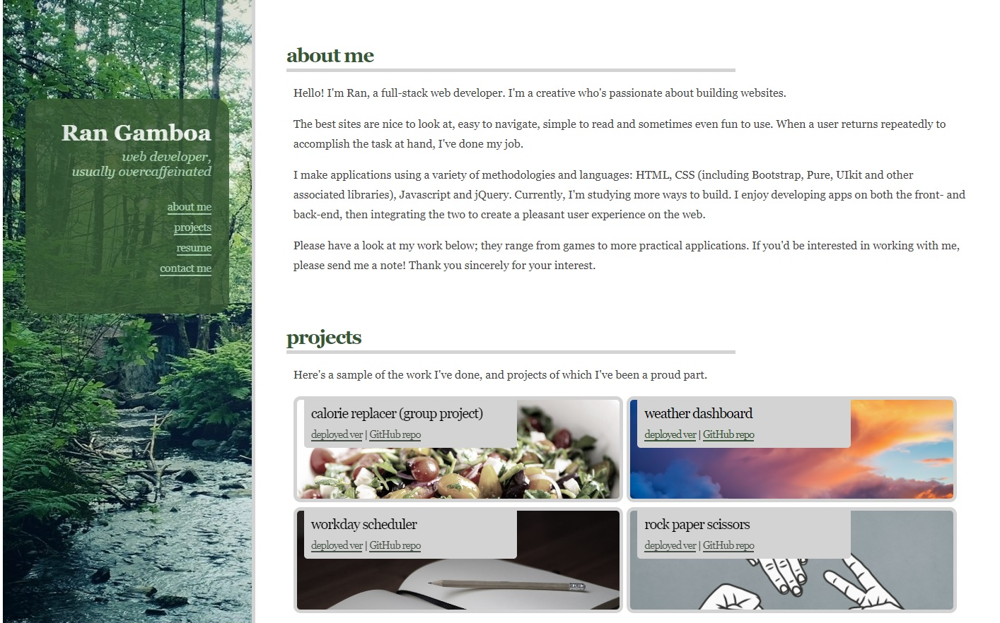

# Personal Portfolio
## Task

I created a portfolio of work that showcases the skills I've learned so far in Web Dev bootcamp. This will be instrumental in helping me find employers looking to fill a part-time or full-time position. Since I will just be starting out in the industry, a well-designed and functional portfolio is an especially important way to showcase the projects that have been successful.
## Resources

I used the Pure CSS library to style the site, as well as the lessons learned previous bootcamp lessons.

* W3Schools

* MDN

* Pure CSS

## Link to Deployed Github Page

[Portfolio](https://rangamboa.github.io/portfolio/)

## Screenshots

- - -
© 2021 Ran Gamboa